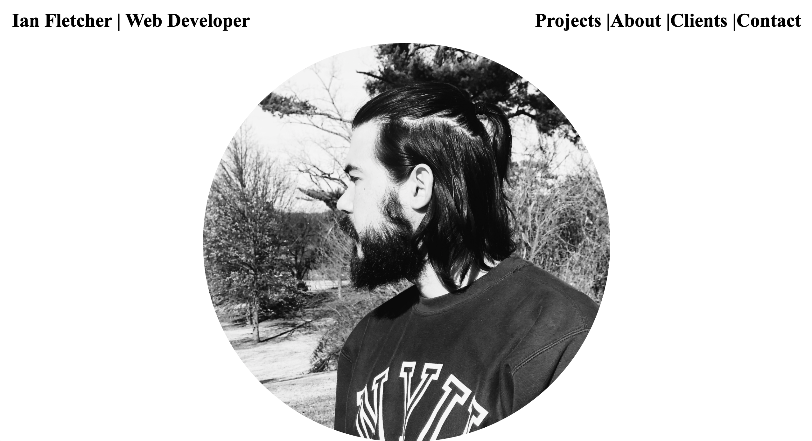
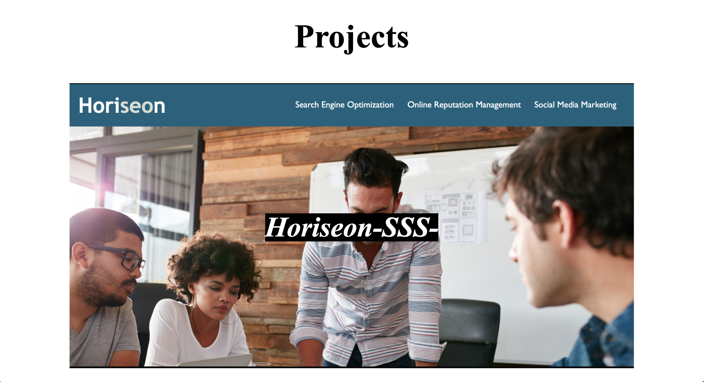

# Ian Fletcher's Portfolio

## The Repository 
This Repository is where Ian Fletcher's Portfolio for web design is housed.

## Installation
In order to acess and refractor the code you must first go through the Installation Process

1) Open GitHub and navigate to the main repository 

2) Click the green "Code" button Above the top right corner of the files 

3) To clone the repository using HTTPS, under "Clone with HTTPS", click the clipboard icon. To clone the repository using an SSH key, including a certificate issued by your organization's SSH certificate authority, click "Use SSH", then click the clipboard icon. To clone a repository using GitHub CLI, click "Use GitHub CLI", then click the clipboard icon.

4) Open Terminal and navigate to the directory where you want the repository to be 

5) Type "git clone ", and then paste the SSH, CLI, or HTTPS link you coppied on GitHub and press ENTER 

This should put a copy of the repository into the directory you had chosen in step 1

## Usage
This site should allow users to easily learn about the differnt web design projects Ian Fletcher has completed. There is also a section where the user can learn more about Ian, and get in contact with him. 

## Languages and Technologies Used
CSS  
HTML  

[Check Out The Full Page](https://ianfletcher314.github.io/IanFletcherPortfolio/)

## Credits

- [GitHub's Document on Cloning Repositories (used in Instalation section)](https://docs.github.com/en/github/creating-cloning-and-archiving-repositories/cloning-a-repository) 
- [VS Code's ReadMe Page (used for formating and licensing syntax)](https://github.com/microsoft/vscode/blob/master/README.md)

## License 

Copyright (c) Horision SSS Inc. All Rights Reserved.

Licensed under the [MIT](assets/license.txt) license
